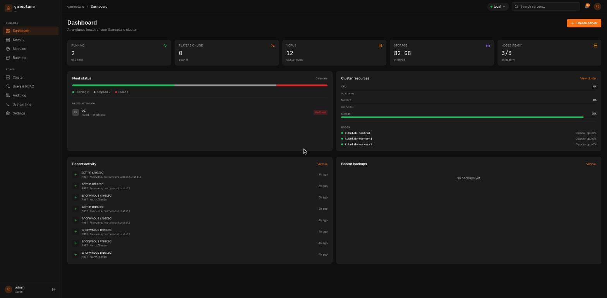
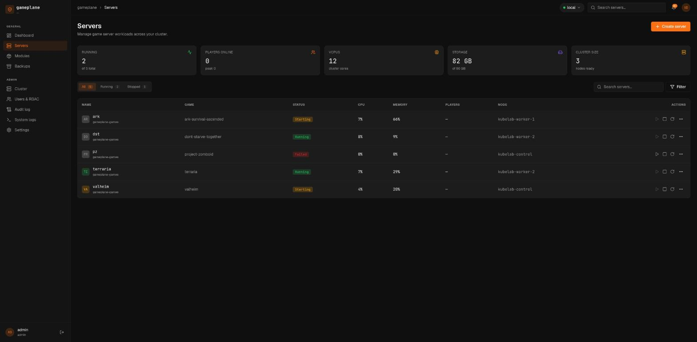
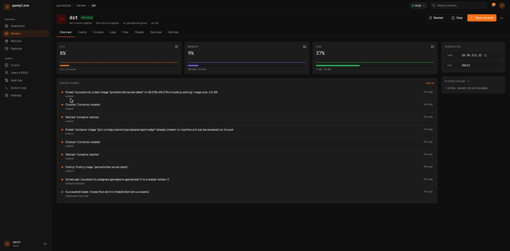
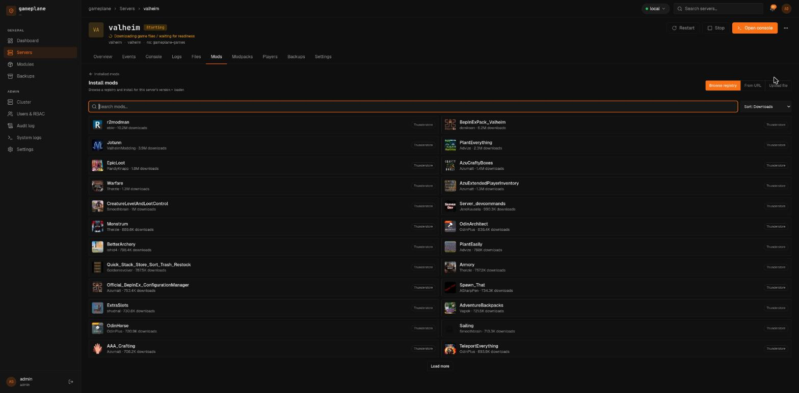
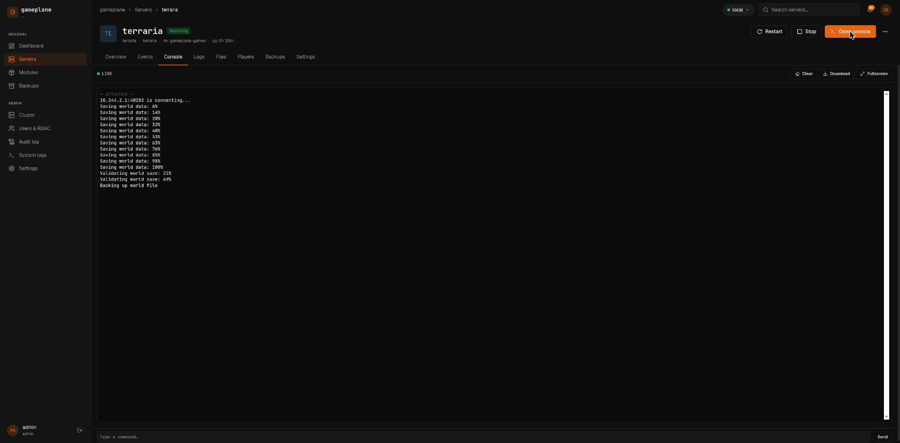
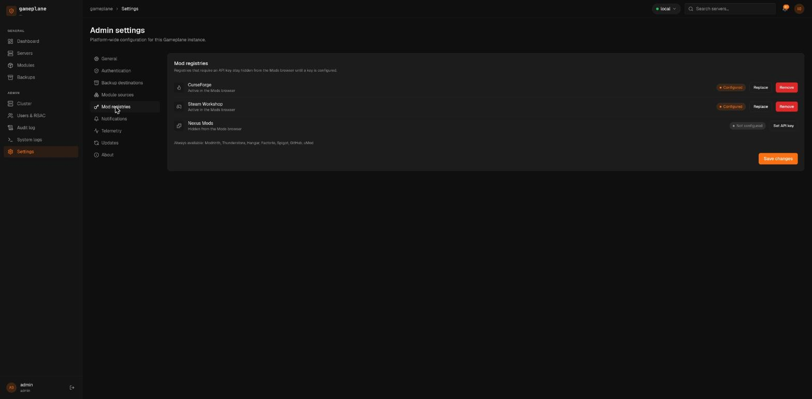

# Gameplane

A Kubernetes-native game server control panel. Open-source alternative to
[CubeCoders AMP](https://cubecoders.com/AMP) with a K8s backend instead of
Docker — scales from a single-node k3s homelab to multi-node production
clusters without changing the operational model.

> Status: **beta** (`v0.2.0-beta.7`). The operator, API, agent, and dashboard
> are feature-complete for the v1 scope and stabilized for external testing.
> See [Beta status & known limitations](#beta-status--known-limitations) before
> running it for anything you can't afford to lose.

**Website:** <https://valgulnecron.github.io/gameplane-website/> — features,
docs, and comparisons. Source lives in
[`gameplane-website`](https://github.com/ValgulNecron/gameplane-website),
mounted here as the `website/` submodule.

## Screenshots

| | |
|---|---|
|  |  |
| Dashboard — fleet health at a glance | Servers — every game server, one list |
|  |  |
| Server detail — Overview | Mods — browsing a registry (Thunderstore) |
|  |  |
| Console — live output over WebSocket | Admin Settings — Mod registries |

## Beta status & known limitations

Gameplane is in **beta**: the core workflows — deploy a game server, console,
files, backups/restore, modules, RBAC — work end to end and are covered by
unit, integration (envtest), and kind-based e2e suites.

**Multi-cluster is wired end to end**: register additional clusters from the
**Cluster** page, switch between them from the cluster selector in the
top bar, and RBAC, audit, and e2e coverage all thread the cluster dimension.
One caveat — WebSocket streams (console, logs) stay scoped to the
locally-configured cluster; that's a documented follow-up.

Before you rely on it, know that:

- **Official module signing isn't active yet.** The keyed-cosign mechanism is
  implemented and e2e-proven, and `ModuleSource.spec.verify` can already
  require a valid signature — but the officially-published bundles aren't
  signed until a maintainer provisions the signing key as a CI secret.
- A handful of production-readiness items are still open: a documented
  backup/restore drill against a real restic repository, upgrade testing
  across minor versions, and pinning the shipped modules' floating `latest`
  image tags. None of these are code gaps — see
  [`docs/roadmap.md`](docs/roadmap.md) for the full, current list.

[`docs/roadmap.md`](docs/roadmap.md) tracks everything that stands between beta
and a v1 GA.

CI runs the full suite (unit, envtest, and kind e2e) on every PR. The kind
e2e jobs can occasionally flake under resource pressure on the self-hosted
runner; re-running the job clears transient infrastructure failures.

## Why

AMP is great, but it's bound to a single host running Docker. If you want:

- a spare PC running one Minecraft server, **and**
- a 5-node cluster hosting a dozen games across a club or small hosting shop,

the existing options force you to pick a side. Gameplane uses standard
Kubernetes primitives (CRDs, operators, StatefulSets, PVCs) so the same
control plane handles both.

## Feature goals

- **Lifecycle**: create, start, stop, restart, clone, delete game servers. Stop
  and restart run the template's declared shutdown sequence first — over
  Source RCON, telnet RCON, or (for pty-console games with no RCON) a
  pod-attach to stdin — so a restart saves the world instead of just sending
  SIGTERM.
- **Console**: live stdout/stderr over WebSocket, RCON stdin
- **Logs**: historical log viewer with filtering and download
- **Files**: browse, edit, upload, download server files (Monaco editor in-browser)
- **Players**: per-server player list with kick/ban where the game protocol supports it
- **Backups**: scheduled + on-demand snapshots to S3-compatible storage (restic), with restore back into a server
- **Modules**: versioned game templates distributed as OCI artifacts — 16
  games shipped today, see [`modules/`](modules/)
- **Mods**: install mods across 10 registries, gated by API key where the
  registry requires one — see [Mods](#mods) below
- **Users & RBAC**: local accounts + OIDC (Keycloak, Google, GitHub)
- **Multi-cluster**: register and switch between clusters from one dashboard —
  the cluster selector, RBAC, and audit log all carry the cluster dimension

## Mods

Gameplane's mod manager supports two install models, chosen per game template:

- **File-drop** — the agent downloads the mod file straight into a per-loader
  volume (Minecraft's `mods/`/`plugins/`, Valheim's BepInEx `plugins/`, and so
  on). This is the model behind the Mods tab's "Install mod" registry browser.
- **Mods-by-ID** — for games whose *server itself* downloads mods at launch
  (ARK's CurseForge `-mods=` flag, Project Zomboid, Steam Workshop id lists),
  the operator projects the selected mod IDs into a launch environment
  variable instead of fetching anything itself.

Ten registries are supported: Modrinth, CurseForge, Thunderstore, Hangar, the
Factorio mod portal, Steam Workshop, SpigotMC, GitHub Releases, uMod, and
Nexus Mods. Modrinth, Thunderstore, Hangar, Factorio, SpigotMC, GitHub, and
uMod work with no configuration. CurseForge, Steam Workshop, and Nexus Mods
need an API key — set one in **Settings → Mod registries** and the registry
un-hides itself in the Mods browser; until then it's simply absent, not shown
broken. Keys are stored in a Kubernetes Secret and the API never returns the
raw value back, even to the admin who set it.

Two caveats: **Nexus Mods is browse-only** — its download links are
premium-account- and requester-IP-gated, so Gameplane can't complete a
one-click install; you follow the mod page from there yourself. And
**Factorio mod portal downloads need the user's own factorio.com
username + token**, appended in the install form — the portal ties download
links to the requesting account, so Gameplane can't hold or proxy that
credential on your behalf.

## Architecture

```
┌────────────────────────────────────────────────────────────────┐
│  Browser: React + TypeScript + Vite + shadcn/ui                │
└────────────────────────────────────────────────────────────────┘
                            │  HTTPS / WSS
┌────────────────────────────────────────────────────────────────┐
│  API (Go):  REST + WebSocket, auth, RBAC, aggregates CRD state │
└────────────────────────────────────────────────────────────────┘
                            │  K8s API
┌────────────────────────────────────────────────────────────────┐
│  Operator (Go, controller-runtime):                            │
│    reconciles GameServer / GameTemplate / Backup /             │
│    BackupSchedule / Restore CRDs into StatefulSet, Service,    │
│    PVC, and restic Jobs                                        │
└────────────────────────────────────────────────────────────────┘
                            │
┌────────────────────────────────────────────────────────────────┐
│  GameServer pod:                                               │
│    ├── game container (minecraft, valheim, ...)                │
│    └── agent sidecar (Go): RCON, file ops, log tail, metrics   │
└────────────────────────────────────────────────────────────────┘
```

### Components

| Path         | Language | Purpose                                                           |
| ------------ | -------- | ----------------------------------------------------------------- |
| `netguard/`  | Go       | Shared SSRF dial-guard used by the operator (module fetches) and agent (mod installs). |
| `operator/`  | Go       | Reconciles CRDs into K8s objects. Built with controller-runtime.  |
| `api/`       | Go       | Front-end-facing REST + WebSocket gateway. chi, coder/websocket. |
| `agent/`     | Go       | Sidecar running in each game pod. RCON, file ops, PTY console.   |
| `audit-syslog-bridge/` | Go | Optional HTTP-JSON → syslog relay behind the audit webhook sink. |
| `telemetry-receiver/` | Go | Optional collector for the API's anonymous daily usage report. |
| `mcp-server/` | Go | Optional strictly read-only MCP server for AI assistants (stdio, no writes). |
| `web/`       | TS+React | Dashboard UI. Vite, TanStack Query, xterm.js, Monaco.             |
| `modules/`   | YAML     | Per-game `GameTemplate` bundles (Minecraft, Valheim, …).          |
| `charts/`    | Helm     | `gameplane` install chart for operator + API + optional ingress.    |
| `deploy/`    | Shell    | Local dev env (kind/k3d) bootstrap scripts.                       |

### CRDs (`gameplane.local/v1alpha1`)

- **GameTemplate** — reusable blueprint for a game (image, ports, env, volumes, defaults)
- **GameServer** — an instance of a GameTemplate with user-specific config
- **Backup** — a one-shot snapshot job
- **BackupSchedule** — a cron-like recurring backup policy
- **Restore** — a one-shot restore of a Backup snapshot into a GameServer's data volume
- **Module** — an installed module bundle; the operator materializes and owns a GameTemplate from it
- **ModuleSource** — a registered store (OCI, git, http, local, or upload) Gameplane pulls module bundles from
- **Cluster** — a registered remote Kubernetes cluster the control plane can target

## Repo layout

```
.
├── netguard/     # shared SSRF dial-guard (operator + agent)
├── operator/     # controller-runtime operator
│   ├── api/v1alpha1/     # CRD Go types
│   ├── internal/controller/
│   ├── cmd/              # operator main.go
│   └── config/{crd,rbac,samples}
├── api/          # REST + WS gateway
├── agent/        # in-pod sidecar
├── audit-syslog-bridge/  # optional HTTP-JSON → syslog relay
├── web/          # React dashboard
├── modules/      # git submodule → gameplane-module repo (OCI bundles)
│   ├── minecraft-java/  valheim/  terraria/  rust/  ...  # 16 games total
│   └── build.sh  # OCI bundle builder/pusher (uses oras)
├── website/      # git submodule → gameplane-website repo (public site)
├── charts/gameplane/       # Helm chart
├── deploy/kind/          # local dev cluster
├── docs/
├── cosign.pub    # public key for verifying signed images + module bundles
└── design.pen    # Pencil design source (do not delete)
```

## Install on a cluster

The Helm chart and component images are published to the GitHub Container
Registry as OCI artifacts — no `helm repo add` required:

```sh
helm upgrade --install gameplane oci://ghcr.io/valgulnecron/charts/gameplane \
  --version <version> \
  --namespace gameplane-system --create-namespace \
  --set ingress.host=gameplane.your-domain.test
```

The chart pins matching `ghcr.io/valgulnecron/gameplane/{operator,api,agent}`
images by `appVersion`. To track the rolling beta instead of a tagged release,
add `--set image.tag=edge`. Then seed an admin user and log in — see
[`docs/install.md`](docs/install.md) for the full flow, OIDC, Postgres, and
values reference.

All published images and module bundles are signed with the project's
cosign key ([`cosign.pub`](cosign.pub), also baked into the chart for
module verification). Signing is offline/keyed — no transparency log —
so verification needs the matching flag:

```sh
cosign verify --key cosign.pub --insecure-ignore-tlog=true \
  ghcr.io/valgulnecron/gameplane/operator:<version>
```

## Quickstart (local dev)

Requires: Go 1.25+, Node 20+, Docker, kind, kubectl, helm,
[oras](https://oras.land/docs/installation) (>= 1.2.0).

The game modules live in the separate `gameplane-module` repo, wired in here
as the `modules/` submodule — clone with submodules (or initialize them after):

```sh
git clone --recurse-submodules <repo-url>
# already cloned? populate the submodule:
git submodule update --init
```

```sh
# spin up a local kind cluster with Gameplane preinstalled
make dev-up

# in another shell, run the web app against the in-cluster API
make web-dev

# tear down
make dev-down
```

The `make dev-up` target:

1. creates a kind cluster from `deploy/kind/cluster.yaml` and a local
   OCI registry at `localhost:5001` (reachable from cluster pods as
   `kind-registry:5000`),
2. loads locally-built operator/api/agent images,
3. pushes every directory under `modules/` (16 games at last count — see
   `modules/` for the current list) to the local registry as an OCI module
   bundle,
4. installs the Helm chart from `charts/gameplane/` with a default
   `ModuleSource` pointing at the local registry — the operator
   indexes it within seconds and the modules show up in the dashboard's
   Modules page.

See [`docs/module-authoring.md`](docs/module-authoring.md) for the
bundle format and how to author additional modules.

## Contributing

Design changes go through `design.pen` (Pencil) before any UI code is
written. See [`docs/contributing.md`](docs/contributing.md) for the
full guide: code style, test tiers, and the PR process.

## License

[AGPL-3.0-or-later](./LICENSE). Any network-accessible deployment of a
modified version must make its source available to users.
