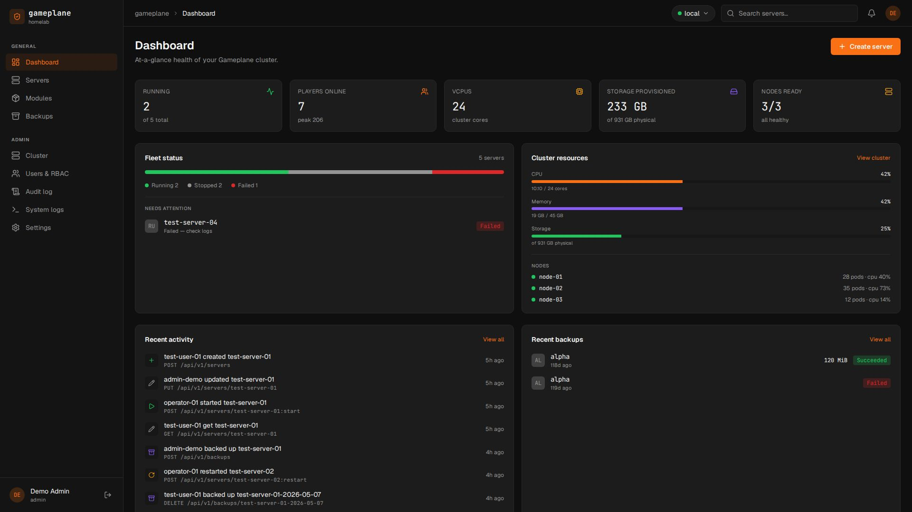
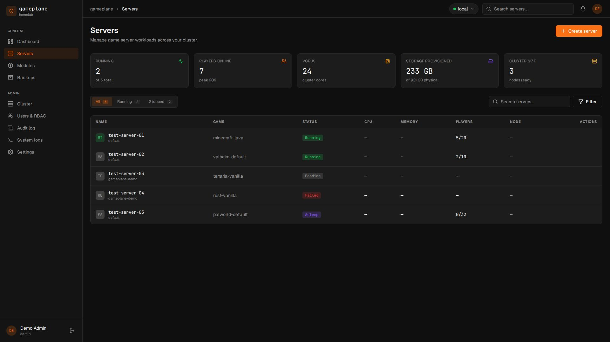
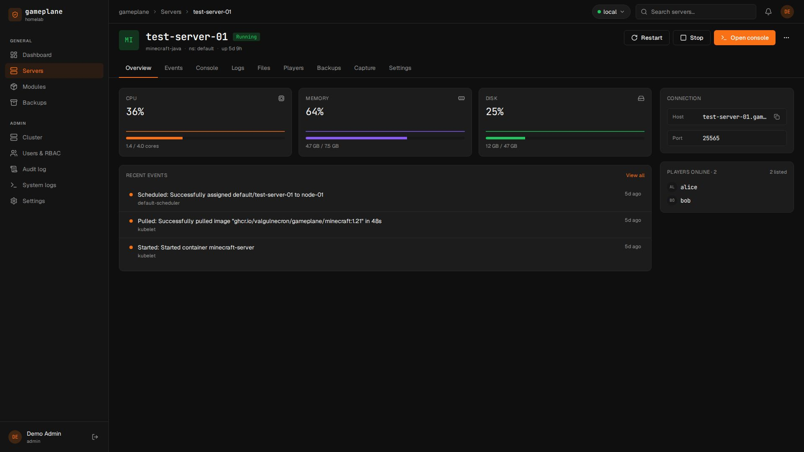
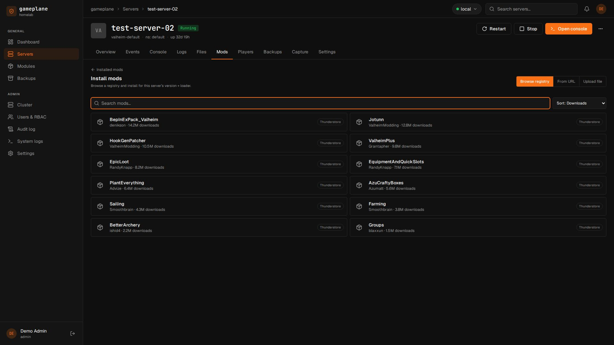
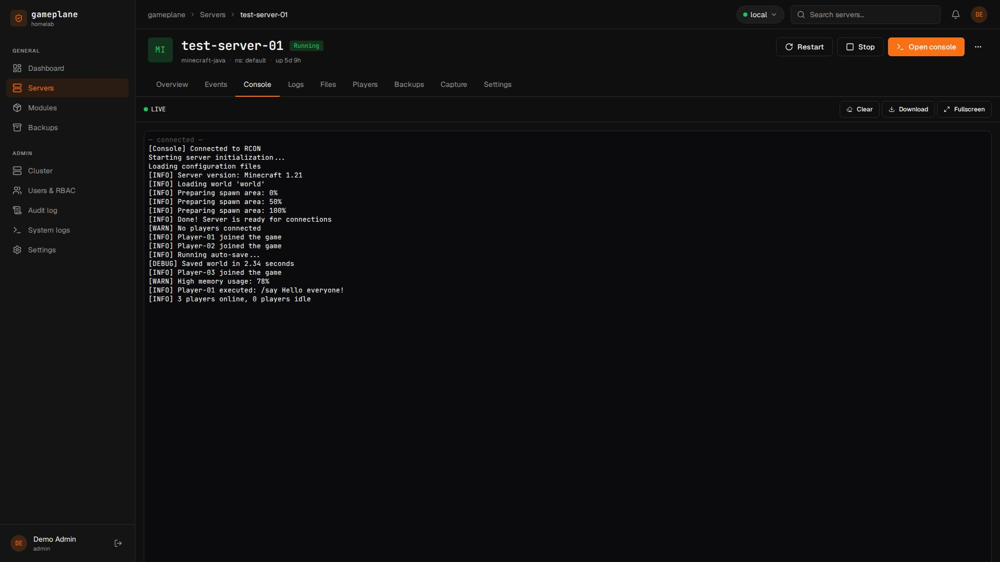
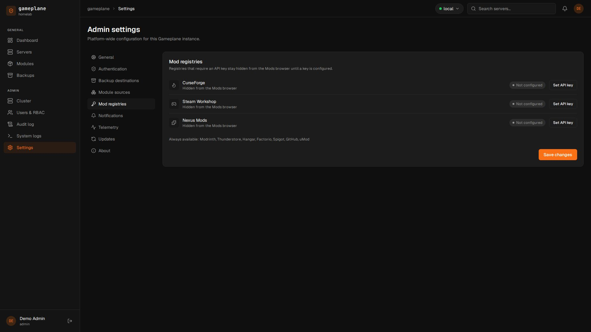

# Gameplane

A Kubernetes-native game server control panel. Open-source alternative to
[CubeCoders AMP](https://cubecoders.com/AMP) with a K8s backend instead of
Docker — scales from a single-node k3s homelab to multi-node production
clusters without changing the operational model.

> Status: **beta** (`v0.2.0-beta.8`). The operator, API, agent, and dashboard
> are feature-complete for the v1 scope and stabilized for external testing.
> See [Beta status & known limitations](#beta-status--known-limitations) before
> running it for anything you can't afford to lose.

**Website:** <https://valgulnecron.github.io/gameplane-website/> — features,
docs, and comparisons. Source lives in
[`gameplane-website`](https://github.com/ValgulNecron/gameplane-website),
mounted here as the `website/` submodule.

## Screenshots

| | |
|---|---|
|  |  |
| Dashboard — fleet health at a glance | Servers — every game server, one list |
|  |  |
| Server detail — Overview | Mods — browsing a registry (Thunderstore) |
|  |  |
| Console — live output over WebSocket | Admin Settings — Mod registries |

## Beta Status & Limitations

Gameplane is currently in **beta** (`v0.2.0-beta.8`). Core workflows — server deployment, live consoles, file management, backups/restores, game modules, multi-cluster management, and RBAC — work end-to-end and are verified by automated unit, integration, upgrade, and end-to-end test suites on every commit.

Here are a few items to keep in mind:

- **Multi-cluster streaming**: You can register and manage multiple clusters from a single dashboard, but WebSocket console/log streaming is currently scoped to the local control-plane cluster.
- **Idle auto-sleep & wake-on-connect**: Sleeping servers require normal game boot time when waking up. Minecraft Java and Terraria support full protocol handshake parsing to hold client connections while waking; other games use packet heuristics where players reconnect once the server is ready.
- **Relay Tunnels**: Integrated `frp`, `Tailscale`, and `playit` relays run as supervised sidecar pods. For `playit`, port-forward mappings are managed directly through your playit.gg account.
- **Production readiness**: Automated release upgrade testing runs on every PR. Disaster-recovery runbooks and fine-tuned workload resource guidance are actively being finalized (see [`docs/roadmap.md`](docs/roadmap.md)).

[`docs/roadmap.md`](docs/roadmap.md) tracks all items leading to a v1 GA release.

## Why Gameplane?

Popular panels like AMP or Pterodactyl work well for single Docker hosts. However, if you want to scale from a single homelab machine running one server to a multi-node cluster hosting dozens of game servers across a community or hosting service, traditional panels force you to change your infrastructure setup.

Gameplane uses standard Kubernetes primitives (CRDs, operators, StatefulSets, PVCs) so the exact same control plane handles everything from single-node k3s installs to large multi-node clusters seamlessly.

## Features

- **Graceful Lifecycle Management**: Create, start, stop, restart, clone, and delete game servers. Stopping or restarting executes the game's native shutdown sequence (over RCON, telnet, or stdin) first, ensuring world saves complete before stopping containers.
- **Smart Idle Auto-Sleep & Wake-on-Connect**: Save hardware resources by automatically scaling empty servers down to zero after a set idle period. Servers wake up automatically on scheduled cron windows, via the dashboard **Wake** button, or when players attempt to join.
- **Built-in Relay Tunnels**: Host servers on home labs or behind CGNAT without public IPs or router port-forwarding using integrated `frp`, `Tailscale`, or `playit.gg` relay sidecars.
- **Live Console & Admin Actions**: Stream stdout/stderr in real time over WebSockets, send RCON/stdin commands, and execute custom game admin actions (like broadcast messages or give items) safely with built-in injection guards.
- **Web File Manager**: Browse, edit, upload, and download server files directly in the browser with an integrated Monaco code editor.
- **Player Management**: View active players and issue kicks or bans for supported game protocols.
- **S3 Backups & Restores**: Perform on-demand or cron-scheduled restic snapshots to S3-compatible storage, with one-click restoration into server volumes.
- **OCI Game Modules**: 16 ready-to-use game templates packaged as OCI artifacts (Minecraft Java, Valheim, Terraria, Rust, Palworld, Factorio, CS2, etc.).
- **Extensive Mod Support**: Browse and install mods across 10 registries (Modrinth, CurseForge, Steam Workshop, Thunderstore, SpigotMC, Hangar, etc.) with support for both direct file-drop and launch-parameter mod IDs.
- **Authentication & RBAC**: Local user accounts plus OIDC SSO support (Keycloak, Google, GitHub) with fine-grained access permissions.
- **Multi-Cluster Fleet Management**: Register, monitor, and manage game servers across multiple Kubernetes clusters from a single dashboard.

## Mod Management

Gameplane supports two distinct mod installation models, depending on how the game handles mods:

- **File-Drop**: The sidecar agent downloads mod files directly into dedicated plugin/mod volumes (e.g., Minecraft `mods/`/`plugins/` or Valheim BepInEx `plugins/`). All downloads are validated through `netguard` SSRF protection.
- **Mods-by-ID**: For games where the server binary fetches mods on launch (such as ARK's CurseForge `-mods=` flag, Project Zomboid, or Steam Workshop IDs), Gameplane projects selected mod IDs directly into launch environment variables.

### Supported Registries

Gameplane integrates with **10 mod registries**: Modrinth, CurseForge, Thunderstore, Hangar, Factorio Mod Portal, Steam Workshop, SpigotMC, GitHub Releases, uMod, and Nexus Mods.

- **No setup required**: Modrinth, Thunderstore, Hangar, Factorio, SpigotMC, GitHub, and uMod work out of the box.
- **API Key required**: CurseForge, Steam Workshop, and Nexus Mods require an API key configured under **Settings → Mod registries**. Keys are securely stored in Kubernetes Secrets.
- **Registry Caveats**: Nexus Mods is browse-only because download links require a premium account and direct requester IP. Factorio downloads require the user's `factorio.com` credentials in the install form.

## Architecture

```
┌────────────────────────────────────────────────────────────────┐
│  Dashboard UI: React + TypeScript + Vite + shadcn/ui           │
└────────────────────────────────────────────────────────────────┘
                            │  HTTPS / WSS
┌────────────────────────────────────────────────────────────────┐
│  API Gateway (Go): REST + WebSocket, Auth, RBAC, State Agg    │
└────────────────────────────────────────────────────────────────┘
                            │  Kubernetes API
┌────────────────────────────────────────────────────────────────────────┐
│  Operator (Go, controller-runtime):                                    │
│    Reconciles CRDs (GameServer, GameTemplate, Backup,                  │
│    BackupSchedule, Restore, Module, ModuleSource, Cluster)             │
│    into StatefulSets, Services, PVCs, Jobs, & Helper Pods              │
└────────────────────────────────────────────────────────────────────────┘
        │                              │                              │
┌───────┴───────────────┐   ┌──────────┴────────────┐     ┌───────────┴──────────┐
│ GameServer Pod:       │   │ Sentinel Waker Pod:   │     │ Tunnel Relay Pod:    │
│ ├── Game Container    │   │ └── Daemon (Go):      │     │ └── Supervisor (Go): │
│ └── Agent Sidecar     │   │     Wake-on-connect   │     │     frp / Tailscale  │
│     (Go): RCON, files │   │     handshake listener│     │     / playit relay   │
└───────────────────────┘   └───────────────────────┘     └──────────────────────┘
```

### Components

| Path | Language | Description |
| ---- | -------- | ----------- |
| `agent/` | Go | Sidecar running in each game pod for RCON, file ops, PTY console, and metrics. |
| `api/` | Go | Front-end API gateway handling REST endpoints, WebSocket streaming, auth, and RBAC. |
| `operator/` | Go | Kubernetes controller reconciling Gameplane CRDs into K8s workloads and resources. |
| `sentinel/` | Go | Waker daemon listening on game ports while a server is sleeping to trigger wake-on-connect. |
| `capture-sidecar/` | Go | Optional network packet capture sidecar, opt-in per server, admin-only. |
| `tunnel/` | Go | Relay supervisor pod managing third-party tunnels (`frp`, `Tailscale`, `playit`). |
| `web/` | TS + React | Modern dashboard UI built with Vite, TanStack Query, xterm.js, and Monaco Editor. |
| `modules/` | YAML | 16 pre-packaged game templates (Minecraft, Valheim, Terraria, Rust, etc.) as OCI bundles. |
| `charts/` | Helm | Official Helm deployment chart for operator, API gateway, ingress, and helper services. |
| `gameproto/` | Go | Shared protocol library for parsing game handshakes (Minecraft, Terraria) in `sentinel`. |
| `gameaction/` | Go | Security guard and command renderer for custom module admin actions. |
| `netguard/` | Go | SSRF protection layer for outgoing mod downloads and OCI module fetches. |
| `svcutil/` | Go | Shared HTTP server lifecycle and environment configuration utilities. |
| `audit-syslog-bridge/` | Go | Optional HTTP-JSON to syslog relay for audit logging infrastructure. |
| `telemetry-receiver/` | Go | Optional collector for anonymous daily usage reports. |
| `mcp-server/` | Go | Optional strictly read-only Model Context Protocol server for AI tools. |

### Custom Resource Definitions (CRDs)

Gameplane extends Kubernetes using custom resources under `gameplane.local/v1alpha1`:

- **`GameTemplate`**: Reusable blueprint for a game (container image, default ports, environment variables, volume layouts, shutdown hooks, and custom admin actions).
- **`GameServer`**: An active game server instance created from a `GameTemplate` with customized resources, storage, idle auto-sleep settings, networking, relay tunnels, and backup policies.
- **`Backup`**: A one-shot restic snapshot job targeting S3-compatible storage.
- **`BackupSchedule`**: A recurring cron backup policy attached to a game server.
- **`Restore`**: A task that restores a backup snapshot into a server data volume.
- **`Module`**: An installed game bundle managed by the operator to materialize a `GameTemplate`.
- **`ModuleSource`**: A registered game template repository (OCI registry, Git repository, HTTP server, or local upload).
- **`Cluster`**: A registered remote Kubernetes cluster target for multi-cluster control plane management.

## Repository Layout

```
.
├── agent/                # Game pod sidecar (RCON, files, PTY console, metrics)
├── api/                  # REST & WebSocket API gateway
├── operator/             # Kubernetes operator (controller-runtime)
│   ├── api/v1alpha1/     # CRD Go type definitions
│   ├── internal/controller/
│   └── config/           # CRD manifests and RBAC rules
├── sentinel/             # Wake-on-connect daemon (Go)
├── tunnel/               # Relay client supervisor for frp/Tailscale/playit (Go)
├── web/                  # Dashboard frontend (React, Vite, Monaco, xterm.js)
├── modules/              # Submodule: Game templates (16 games shipped)
├── website/              # Submodule: Public documentation site
├── gameproto/            # Wire-protocol parsing library (Minecraft, Terraria)
├── gameaction/           # Console injection guard & action command renderer
├── netguard/             # SSRF dial-guard library
├── svcutil/              # Shared HTTP server & env utilities
├── audit-syslog-bridge/  # Optional syslog relay for audit logs
├── telemetry-receiver/   # Optional anonymous usage telemetry receiver
├── mcp-server/           # Optional read-only Model Context Protocol server
├── charts/gameplane/     # Helm deployment chart
├── deploy/kind/          # Local dev environment bootstrap scripts
├── docs/                 # Technical documentation & guides
├── specs/                # Feature specifications and proposals
└── test/                 # Integration & end-to-end kind test suites
```

## Installation

The Helm chart and component images are published to the GitHub Container
Registry as OCI artifacts — no `helm repo add` required:

```sh
helm upgrade --install gameplane oci://ghcr.io/valgulnecron/charts/gameplane \
  --version <version> \
  --namespace gameplane-system --create-namespace \
  --set ingress.host=gameplane.your-domain.test
```

The chart pins matching `ghcr.io/valgulnecron/gameplane/{operator,api,agent}`
images by `appVersion`. To track the rolling beta instead of a tagged release,
add `--set image.tag=edge`. Then seed an admin user and log in — see
[`docs/install.md`](docs/install.md) for the full flow, OIDC, Postgres, and
values reference. For address pool configuration (pinning servers to specific
public IP addresses), see [`docs/networking.md`](docs/networking.md).

All published images, the Helm chart, and official module bundles are signed
with the project's cosign key ([`cosign.pub`](cosign.pub), also baked into
the chart for module verification) and recorded in the public Sigstore Rekor
transparency log:

```sh
cosign verify --key cosign.pub \
  ghcr.io/valgulnecron/gameplane/operator:<version>
```

Pre-rotation releases (v0.2.0-beta.7 and earlier) were signed with the retired
Ed25519 key and do not have transparency log entries — verify them with
`cosign-legacy.pub` and `--insecure-ignore-tlog=true`. See
[`docs/key-rotation.md`](docs/key-rotation.md) for details.

## Quickstart (local dev)

Requires: Go 1.25+, Node 20+, Docker, kind, kubectl, helm,
[oras](https://oras.land/docs/installation) (>= 1.2.0).

The game modules live in the separate `gameplane-module` repo, wired in here
as the `modules/` submodule — clone with submodules (or initialize them after):

```sh
git clone --recurse-submodules <repo-url>
# already cloned? populate the submodule:
git submodule update --init
```

```sh
# spin up a local kind cluster with Gameplane preinstalled
make dev-up

# in another shell, run the web app against the in-cluster API
make web-dev

# tear down
make dev-down
```

The `make dev-up` target:

1. creates a kind cluster from `deploy/kind/cluster.yaml` and a local
   OCI registry at `localhost:5001` (reachable from cluster pods as
   `kind-registry:5000`),
2. loads locally-built operator/api/agent images,
3. pushes every directory under `modules/` (16 games at last count — see
   `modules/` for the current list) to the local registry as an OCI module
   bundle,
4. installs the Helm chart from `charts/gameplane/` with a default
   `ModuleSource` pointing at the local registry — the operator
   indexes it within seconds and the modules show up in the dashboard's
   Modules page.

See [`docs/module-authoring.md`](docs/module-authoring.md) for the
bundle format and how to author additional modules.

## Contributing

Design changes go through `design.pen` (Pencil) before any UI code is
written. See [`docs/contributing.md`](docs/contributing.md) for the
full guide: code style, test tiers, and the PR process.

## License

[AGPL-3.0-or-later](./LICENSE). Any network-accessible deployment of a
modified version must make its source available to users.
