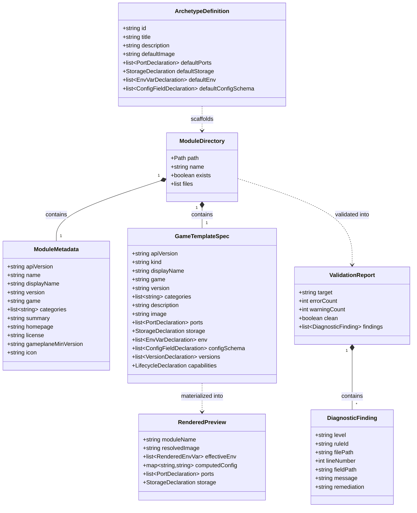

# Data Model: Easy Module Building & Authoring Toolkit

**Branch**: `010-easy-module-building` | **Date**: 2026-08-27 | **Spec**: [spec.md](spec.md)

This document defines the core data entities, schemas, attributes, relationships, and validation constraints for the Easy Module Building & Authoring Toolkit (`gp-module`).

---

## 1. Entity Relationship Diagram



---

## 2. Core Entities

### 2.1 Module Directory Layout (`ModuleDirectory`)

Represents the physical directory structure on disk for a single game module:

| Field | Type | Required | Description |
| :--- | :--- | :---: | :--- |
| `path` | `Path` | Yes | Absolute filesystem path to the module directory (e.g. `/path/to/modules/my-game`) |
| `name` | `string` | Yes | Module slug, must match DNS-1123 label regex `^[a-z0-9]([-a-z0-9]*[a-z0-9])?$` |
| `metadataFile` | `Path` | Yes | Path to `module.yaml` |
| `templateFile` | `Path` | Yes | Path to `template.yaml` |
| `readmeFile` | `Path` | Yes | Path to `README.md` |
| `iconFile` | `Path` | No | Path to `icon.png` (optional asset) |

**Validation Rules**:
- Module directory name MUST match `module.yaml#name`.
- Name length MUST be between 1 and 63 characters.
- Creation MUST fail if directory exists unless `--overwrite` is explicitly specified.

---

### 2.2 Module Metadata (`ModuleMetadata`)

Corresponds to `module.yaml` layer specification:

| Field | Type | Required | Description / Constraints |
| :--- | :--- | :---: | :--- |
| `apiVersion` | `string` | Yes | Fixed constant: `gameplane.local/module/v1` |
| `name` | `string` | Yes | DNS-1123 label; matches folder name; regex: `^[a-z0-9]([-a-z0-9]*[a-z0-9])?$` |
| `displayName` | `string` | Yes | Human-readable title displayed in catalog card (1–100 chars) |
| `version` | `string` | Yes | Strict SemVer 2.0 (e.g. `1.0.0`, `2.1.3-beta.1`) matching OCI tag |
| `game` | `string` | Yes | Game family identifier slug |
| `categories` | `list[string]` | Yes | List of categories; checked against canonical taxonomy |
| `summary` | `string` | Yes | One-line description for catalog card (1–250 chars) |
| `homepage` | `string` | No | Optional valid URI (http/https) |
| `license` | `string` | No | Optional SPDX license identifier (e.g. `MIT`, `Apache-2.0`) |
| `gameplaneMinVersion`| `string` | No | Semver string for minimum supported operator |
| `icon` | `string` | No | Filename of the icon layer in bundle (default: `icon.png`) |

**Canonical Categories**:
`Survival`, `Sandbox`, `Shooter`, `Simulation`, `Building`, `Adventure`, `Horror`, `Co-op`, `PvP`, `Modded`, `Creative`. (Custom categories generate a validation advisory warning).

---

### 2.3 Game Template Spec (`GameTemplateSpec`)

Corresponds to `template.yaml` specification conforming to `GameTemplate` CRD:

| Field | Type | Required | Description / Constraints |
| :--- | :--- | :---: | :--- |
| `apiVersion` | `string` | Yes | Fixed constant: `gameplane.local/v1alpha1` |
| `kind` | `string` | Yes | Fixed constant: `GameTemplate` |
| `metadata` | `object` | Yes | Empty object `{}` (name injected at install time by operator) |
| `spec.displayName` | `string` | Yes | Human-readable title |
| `spec.game` | `string` | Yes | Game family slug matching `module.yaml#game` |
| `spec.version` | `string` | Yes | Semver matching `module.yaml#version` |
| `spec.image` | `string` | Yes | Container image; default image MUST carry `@sha256:...` digest pin unless marked `# gameplane:floating` |
| `spec.ports` | `list[PortDeclaration]` | Yes | Port definitions (1–65535, TCP/UDP) |
| `spec.storage` | `StorageDeclaration`| Yes | Size (e.g. `10Gi`) and mountPath (e.g. `/data`) |
| `spec.env` | `list[EnvVarDeclaration]` | No | Default container environment variables |
| `spec.configSchema` | `list[ConfigField]` | No | Exposable configuration schema fields |
| `spec.versions` | `list[VersionEntry]`| No | Catalog of selectable version variants |

---

### 2.4 Starter Archetype (`ArchetypeDefinition`)

Defines presets for rapid module scaffolding:

```python
@dataclass(frozen=True)
class ArchetypeDefinition:
    id: str                    # "steamcmd" | "java" | "generic"
    title: str                 # Display title
    description: str           # Summary description
    default_image: str         # Default pinned container image
    default_ports: list[dict]  # Default ports (name, containerPort, protocol)
    default_storage: dict      # Default storage (size, mountPath)
    default_env: list[dict]    # Base environment variables
    config_schema: list[dict]  # Archetype-appropriate configSchema
    stop_sequence: list[str]   # Graceful termination commands
```

#### Archetype Presets:
1. **`steamcmd`**:
   - `default_image`: Pinned steamcmd/dedicated server image
   - `default_ports`: `[{"name": "game", "containerPort": 27015, "protocol": "UDP", "advertise": True}]`
   - `default_storage`: `{"size": "20Gi", "mountPath": "/serverdata"}`
   - `default_env`: `[{"name": "STEAMAPPID", "value": "..."}]`
   - `config_schema`: Server name, server password (`type: password`), max players.

2. **`java`**:
   - `default_image`: Pinned Java runtime image (e.g. `eclipse-temurin` or `itzg/minecraft-server`)
   - `default_ports`: `[{"name": "game", "containerPort": 25565, "protocol": "TCP", "advertise": True}]`
   - `default_storage`: `{"size": "10Gi", "mountPath": "/data"}`
   - `default_env`: `[{"name": "EULA", "value": "TRUE"}]`
   - `config_schema`: JVM heap configuration with `autoFromMemoryLimit: {percent: 75}`.

3. **`generic`**:
   - `default_image`: Generic server container
   - `default_ports`: `[{"name": "game", "containerPort": 8080, "protocol": "TCP", "advertise": True}]`
   - `default_storage`: `{"size": "5Gi", "mountPath": "/data"}`
   - `default_env`: `[]`
   - `config_schema`: `[]`

---

### 2.5 Validation Diagnostic Entities (`ValidationReport`, `DiagnosticFinding`)

Captures findings emitted by the offline linting engine:

| Entity | Attribute | Type | Description |
| :--- | :--- | :--- | :--- |
| **`ValidationReport`** | `target` | `string` | Module name or directory path |
| | `errorCount` | `int` | Total blocking errors |
| | `warningCount` | `int` | Total advisory warnings |
| | `clean` | `bool` | `True` when errorCount == 0 and warningCount == 0 |
| | `findings` | `list[DiagnosticFinding]` | Diagnostic entries |
| **`DiagnosticFinding`**| `level` | `string` | `ERROR` or `WARN` |
| | `ruleId` | `string` | Machine-readable rule slug (e.g. `image-unpinned`, `invalid-port-range`) |
| | `filePath` | `string` | File relative or absolute path (e.g. `template.yaml`) |
| | `lineNumber` | `int` | 1-based source line number (0 if not file-anchored) |
| | `fieldPath` | `string` | Dot-notated field path (e.g. `spec.ports[0].containerPort`) |
| | `message` | `string` | Concise description of the violation |
| | `remediation` | `string` | Actionable resolution recommendation |

---

### 2.6 Rendered Server Preview (`RenderedPreview`)

Result of evaluating `template.yaml` against a test configuration:

| Field | Type | Description |
| :--- | :--- | :--- |
| `moduleName` | `string` | Name of the module being simulated |
| `selectedVersion` | `string` | Selected version ID (or "default") |
| `resolvedImage` | `string` | Effective image ref (with digest) |
| `effectiveEnv` | `list[tuple[str, str, str]]` | List of `(name, value, source)` showing origin (`template`, `version`, or `configSchema`) |
| `computedConfig` | `map[string, str]` | Key-value map of computed configuration fields (including `autoFromMemoryLimit`) |
| `ports` | `list[dict]` | Resolved port mappings |
| `storage` | `dict` | Effective storage size and mountPath |

---

### 2.7 OCI Module Bundle Package (`BundlePackage`)

Represents the packaged OCI artifact layer manifest:

| Layer Title | Required | Standard Media Type | Max Size Limit |
| :--- | :---: | :--- | :---: |
| `module.yaml` | Yes | `application/vnd.gameplane.module.metadata.v1+yaml` | 64 KiB |
| `template.yaml` | Yes | `application/vnd.gameplane.module.template.v1+yaml` | 256 KiB |
| `README.md` | Yes | `application/vnd.gameplane.module.readme.v1+md` | 512 KiB |
| `icon.png` | No | `image/png` | 512 KiB |
| **Entire Bundle**| — | `application/vnd.gameplane.module.v1+json` | 1024 KiB (1 MiB) |
