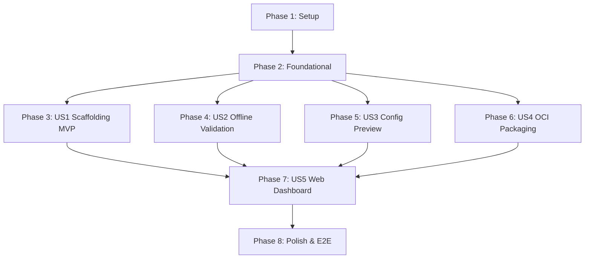

# Tasks: Easy Module Building & Authoring Toolkit

**Input**: Design documents from `/specs/010-easy-module-building/`  
**Prerequisites**: [plan.md](plan.md), [spec.md](spec.md), [research.md](research.md), [data-model.md](data-model.md), [contracts/](contracts/)

---

## Phase 1: Setup (Shared Infrastructure)

**Purpose**: Initialize the `gp-module` Go module and workspace integration.

- [X] T001 Initialize `gp-module/go.mod` (Go 1.26.0, `github.com/ValgulNecron/gameplane/gp-module`) and add `./gp-module` to `go.work`
- [X] T002 Add `gp-module` to `GO_MODULES` in `Makefile` and configure `gp-module` and `module-*` convenience targets
- [X] T003 [P] Create `gp-module/.testcoverage.yml` defining package coverage threshold gates
- [X] T004 [P] Create `gp-module/specs.md` architecture specification satisfying Constitution Principle IV and passing `hack/check-specs.sh`

---

## Phase 2: Foundational (Blocking Prerequisites)

**Purpose**: Core data models, AST utilities, and CLI plumbing required before user stories can begin.

- [X] T005 [P] Implement starter archetype presets and embedded placeholder `icon.png` asset in `gp-module/internal/archetypes/archetypes.go`
- [X] T006 [P] Implement DNS-1123 label validation and naming sanitization in `gp-module/internal/common/validation.go`
- [X] T007 [P] Implement YAML AST parser and source line/column tracker using `gopkg.in/yaml.v3` in `gp-module/internal/common/yaml_ast.go`
- [X] T008 Setup root CLI command structure and argument routing in `gp-module/cmd/gp-module/main.go`

**Checkpoint**: Core foundation and AST parsing utilities ready. User story implementation can now proceed.

---

## Phase 3: User Story 1 - Guided Scaffolding for New Game Modules (Priority: P1) 🎯 MVP

**Goal**: Enable authors to generate pre-validated, schema-compliant module directories for `steamcmd`, `java`, and `generic` archetypes via interactive prompts or automated flags.

**Independent Test**: Execute `gp-module init` with both interactive prompts and non-interactive flags; verify `module.yaml`, `template.yaml`, `README.md`, and `icon.png` are created, match schema modelines, and reject invalid DNS-1123 names.

### Tests for User Story 1
- [X] T009 [P] [US1] Unit tests for scaffolding engine and DNS-1123 validation in `gp-module/internal/scaffold/scaffold_test.go`

### Implementation for User Story 1
- [X] T010 [US1] Implement module directory generator and manifest template renderer in `gp-module/internal/scaffold/scaffold.go`
- [X] T011 [US1] Implement interactive terminal prompts and non-interactive flag binding for `init` command in `gp-module/cmd/gp-module/init.go`
- [X] T012 [US1] Implement non-destructive overwrite guards and `--overwrite` flag enforcement in `gp-module/internal/scaffold/scaffold.go`

**Checkpoint**: User Story 1 is fully functional and testable independently. Authors can scaffold all 3 archetypes offline.

---

## Phase 4: User Story 2 - Comprehensive Offline Validation and Linting (Priority: P1)

**Goal**: Provide offline static validation checking metadata, CRD schemas, image digest pinning, canonical categories, port bounds/collisions, and configuration rules with exact line numbers.

**Independent Test**: Run `gp-module validate` against valid modules (confirming 0 errors) and against broken modules (asserting exact line numbers, error codes, and remediation advice).

### Tests for User Story 2
- [X] T013 [P] [US2] Unit tests for offline validation rules in `gp-module/internal/validator/validator_test.go`

### Implementation for User Story 2
- [X] T014 [US2] Implement metadata integrity and schema conformance checks in `gp-module/internal/validator/schema.go`
- [X] T015 [US2] Implement rule checks (digest pinning, canonical categories, port bounds/collisions, credential password type) in `gp-module/internal/validator/rules.go`
- [X] T016 [US2] Implement diagnostic finding aggregator, human-readable terminal formatter, and `--json` reporter in `gp-module/internal/validator/report.go`
- [X] T017 [US2] Implement `validate` command CLI handler with `--offline`, `--strict`, and `--json` flags in `gp-module/cmd/gp-module/validate.go`
- [X] T018 [US2] Update `modules/validate.py` to optionally invoke `gp-module validate --json` for offline preflight checks while preserving backward compatibility

**Checkpoint**: User Story 2 is complete. Modules can be validated offline with precise line-number diagnostics.

---

## Phase 5: User Story 3 - Dry-Run Manifest Rendering & Configuration Preview (Priority: P2)

**Goal**: Simulate runtime server creation from `template.yaml`, accurately resolving version overlays and dynamic memory calculations (`autoFromMemoryLimit`).

**Independent Test**: Run `gp-module preview` with custom version and memory parameters; verify environment variables and computed values match operator logic.

### Tests for User Story 3
- [X] T019 [P] [US3] Unit tests for memory calculation and config materialization in `gp-module/internal/preview/preview_test.go`

### Implementation for User Story 3
- [X] T020 [US3] Implement dynamic memory limit calculator (`autoFromMemoryLimit`) with `k8s.io/apimachinery` in `gp-module/internal/preview/memory.go`
- [X] T021 [US3] Implement environment variable precedence merger (template $\to$ version $\to$ configSchema) and version overlay in `gp-module/internal/preview/preview.go`
- [X] T022 [US3] Implement `preview` command CLI handler with `--version-id`, `--memory`, `--config`, and formatters in `gp-module/cmd/gp-module/preview.go`

**Checkpoint**: User Story 3 is complete. Authors can inspect effective runtime specifications without deploying to Kubernetes.

---

## Phase 6: User Story 4 - One-Step Packaging & Integrity Verification (Priority: P2)

**Goal**: Package module directories into OCI-compliant artifacts with size limits enforcement (icon $\le$ 512 KiB, bundle $\le$ 1 MiB) and automated ORAS/archive export.

**Independent Test**: Run `gp-module package` to produce a `.tar.gz` bundle archive and test pushing to an OCI registry via ORAS.

### Tests for User Story 4
- [X] T023 [P] [US4] Unit tests for bundle packager and asset size verification in `gp-module/internal/packager/packager_test.go`

### Implementation for User Story 4
- [X] T024 [US4] Implement asset size verification and bundle layer manifest checks in `gp-module/internal/packager/packager.go`
- [X] T025 [US4] Implement OCI artifact packaging and `.tar.gz` archive export in `gp-module/internal/packager/packager.go`
- [X] T026 [US4] Implement `package` command CLI handler with `--registry`, `--output`, `--tag`, and `--plain-http` flags in `gp-module/cmd/gp-module/package.go`

**Checkpoint**: User Story 4 is complete. Authors can package and distribute compliant OCI bundles.

---

## Phase 7: User Story 5 - Web Dashboard Module Builder (Priority: P2)

**Goal**: Enable administrators to visually author, validate, preview, and install game modules directly from the web dashboard.

**Independent Test**: In the web dashboard, open "Create Module", choose an archetype, adjust parameters, observe live validation and memory calculation, and verify bundle download and cluster installation.

### Design Pass (Constitution Principle II)
- [X] T027 [P] [US5] Design `BuildModuleDialog` modal wizard in `design.pen` via `pencil` MCP server and export to `design-export/{json,screenshots}/`

### Backend API Implementation
- [X] T028 [P] [US5] Unit and HTTP integration tests for module builder endpoints in `api/internal/handlers/modules_builder_test.go`
- [X] T029 [US5] Implement `/modules/builder/scaffold`, `/modules/builder/validate`, `/modules/builder/preview`, and `/modules/builder/export` endpoints in `api/internal/handlers/modules_builder.go`

### Web Frontend Implementation
- [X] T030 [P] [US5] Add Module Builder API methods to `web/src/lib/endpoints.ts`
- [X] T031 [US5] Implement React `BuildModuleDialog` component wizard matching Pencil design in `web/src/components/modules/BuildModuleDialog.tsx`
- [X] T032 [P] [US5] Component interaction tests for `BuildModuleDialog` in `web/src/components/modules/BuildModuleDialog.test.tsx`
- [X] T033 [US5] Add "Create module" action button and dialog integration in `web/src/routes/Modules.tsx` and update `web/src/routes/Modules.test.tsx`

**Checkpoint**: User Story 5 is complete. Full module authoring is functional directly within the web dashboard.

---

## Phase 8: Polish, Integration & E2E Verification

**Purpose**: Cross-cutting documentation, end-to-end Kubernetes verification, and test suite execution.

- [X] T034 [P] Update documentation in `docs/module-authoring.md` covering CLI usage and the Web Module Builder
- [X] T035 [P] Register `TestModule_ScaffoldAndPackage` in `bucket_operator` in `test/e2e/buckets.sh` and verify disjointness via `./test/e2e/buckets.sh verify`
- [X] T036 Implement end-to-end Kubernetes lifecycle test in `test/e2e/module_toolkit_e2e_test.go`
- [X] T037 Run `make check-specs` to verify all Go modules have valid `specs.md` files per Constitution Principle IV
- [X] T038 Run quickstart validation scenarios from `specs/010-easy-module-building/quickstart.md`

---

## Dependencies & Execution Order

### Phase Dependencies



- **Phase 1 (Setup)**: Can start immediately.
- **Phase 2 (Foundational)**: Depends on Phase 1; blocks all User Stories.
- **Phase 3 (US1 - MVP)**: Can start immediately after Phase 2.
- **Phase 4 (US2)**, **Phase 5 (US3)**, **Phase 6 (US4)**: Can proceed in parallel once Phase 2 is complete.
- **Phase 7 (US5 - Web)**: Depends on core Go engines (US1, US2, US3, US4) being callable by `api/`. Requires T027 (Pencil design) before T031 (React code).
- **Phase 8 (Polish & E2E)**: Depends on all user stories being complete.

---

## Parallel Execution Examples

### Parallel Wave 1 (Setup & Foundational)
```bash
# Can run concurrently:
Task: T003 Create gp-module/.testcoverage.yml
Task: T004 Create gp-module/specs.md
Task: T005 Implement starter archetype presets in gp-module/internal/archetypes/
Task: T006 Implement DNS-1123 validation in gp-module/internal/common/validation.go
Task: T007 Implement YAML AST parser in gp-module/internal/common/yaml_ast.go
```

### Parallel Wave 2 (Core CLI Engines)
```bash
# Can run concurrently across user stories once Phase 2 completes:
Task: T009 [P] [US1] Unit tests for scaffolding in gp-module/internal/scaffold/
Task: T013 [P] [US2] Unit tests for validator in gp-module/internal/validator/
Task: T019 [P] [US3] Unit tests for preview in gp-module/internal/preview/
Task: T023 [P] [US4] Unit tests for packager in gp-module/internal/packager/
Task: T027 [P] [US5] Pencil design pass in design.pen
```

---

## Implementation Strategy

### MVP Delivery (User Story 1 Only)
1. Complete **Phase 1: Setup** (T001–T004).
2. Complete **Phase 2: Foundational** (T005–T008).
3. Complete **Phase 3: User Story 1** (T009–T012).
4. **STOP & VALIDATE**: Run `bin/gp-module init test-game` to verify scaffolding works independently.

### Incremental Delivery Steps
1. **Increment 1 (MVP)**: CLI Scaffolding (`init`).
2. **Increment 2**: Offline Validation (`validate`).
3. **Increment 3**: Dry-Run Config Preview (`preview`).
4. **Increment 4**: OCI Packaging (`package`).
5. **Increment 5**: Web Dashboard Builder & API (`BuildModuleDialog`).
6. **Increment 6**: End-to-end Kubernetes verification test (`test/e2e`).
