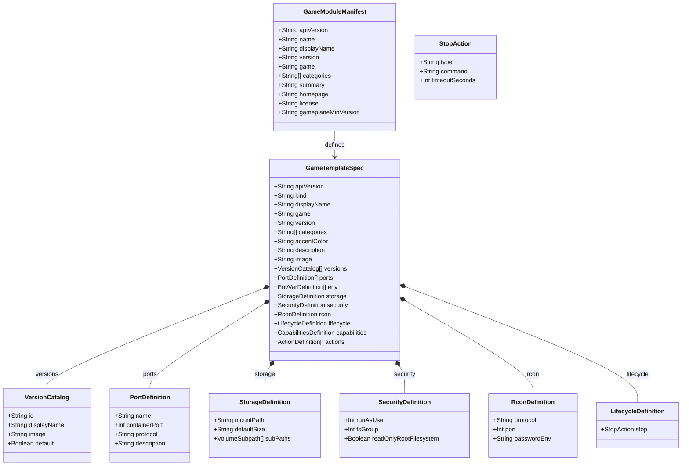
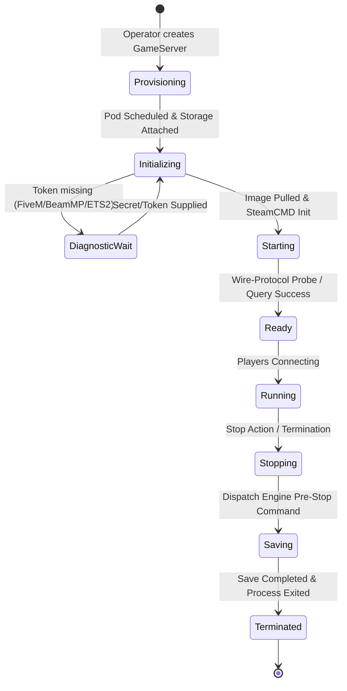

# Data Model: Dedicated Server Modules for Top Steam Games

**Feature**: `014-top-steam-game-modules`  
**Date**: 2026-09-03  
**Status**: Completed  

---

## 1. Entity Architecture Overview

The Gameplane module system structures dedicated game servers into standardized Kubernetes Custom Resources (`GameTemplate`), package manifests (`module.yaml`), architecture specifications (`specs.md`), and operational instances (`GameServer`).

---

## 2. Entity Field Specifications

### 2.1 `GameModuleManifest` (`module.yaml`)
Defined under `.schema/module.schema.json`:

| Field | Type | Required | Description | Example |
|---|---|---|---|---|
| `apiVersion` | string | Yes | Module API version | `gameplane.local/module/v1` |
| `name` | string | Yes | Unique kebab-case module slug | `team-fortress-2` |
| `displayName` | string | Yes | Human-readable game title | `Team Fortress 2` |
| `version` | string | Yes | Semver module revision | `1.0.0` |
| `game` | string | Yes | Canonical game identifier | `tf2` |
| `categories` | string[] | Yes | Genre and playstyle tags | `[Shooter, PvP, Class-Based]` |
| `summary` | string | Yes | Short one-line summary | `Team Fortress 2 dedicated server (Source Engine)` |
| `homepage` | string | Yes | Official game or community URL | `https://www.teamfortress.com` |
| `license` | string | Yes | Module metadata license | `MIT` |
| `gameplaneMinVersion` | string | Yes | Minimum compatible Gameplane version | `0.2.0-beta.7` |

---

### 2.2 `GameTemplate` Spec (`template.yaml`)
Defined under `.schema/gametemplate.schema.json`:

| Field | Type | Required | Description |
|---|---|---|---|
| `spec.displayName` | string | Yes | Human-readable template name |
| `spec.game` | string | Yes | Target game identifier matching `module.yaml` |
| `spec.version` | string | Yes | Template semver |
| `spec.categories` | string[] | Yes | List of category classifications |
| `spec.accentColor` | string | Yes | Hex color code for UI cards (e.g. `#BD3B3B`) |
| `spec.description` | string | Yes | Markdown description of server capabilities |
| `spec.image` | string | Yes | Default fallback container image with `@sha256:` digest |
| `spec.versions` | Version[] | Yes | Curated array of selectable version images with digest pins |
| `spec.ports` | Port[] | Yes | Named port definitions with `UDP` or `TCP` protocol |
| `spec.env` | EnvVar[] | No | Configurable environment variables and defaults |
| `spec.storage` | Storage | Yes | Persistent volume mount point and sizing |
| `spec.security` | Security | Yes | User UID, GID, and filesystem permissions matching image |
| `spec.rcon` | Rcon | No | RCON protocol type, port, and password env key |
| `spec.lifecycle` | Lifecycle | Yes | Pre-stop command sequences for graceful world saves |
| `spec.capabilities`| Caps | No | Supported features (mods, backups, player list, logs) |

---

## 3. State Transitions & Lifecycle Invariants

### 3.1 Server Lifecycle State Machine

### 3.2 Invariants & Validation Rules

1. **Digest Immutability**: Every concrete version in `spec.versions` MUST specify an immutable image digest (`@sha256:...`).
2. **Mount Safety**: `spec.storage.mountPath` MUST NOT match or be an ancestor of the image's `ENTRYPOINT` or `CMD` executable path.
3. **SteamCMD User Invariant**: When `spec.security.runAsUser` is set, `spec.env` MUST include `HOME` pointing to a writable directory if not baked into the image.
4. **Pre-Stop Integrity**: When an engine supports persistence, `spec.lifecycle.stop.command` MUST execute a valid world-save command with a timeout of at least 30 seconds.
