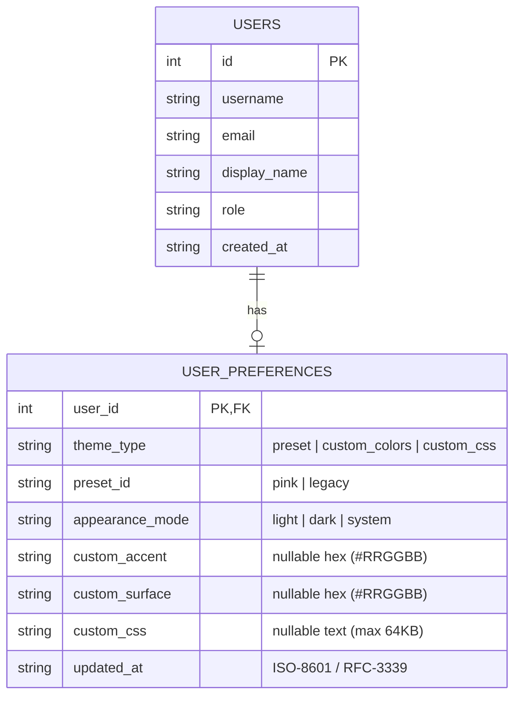
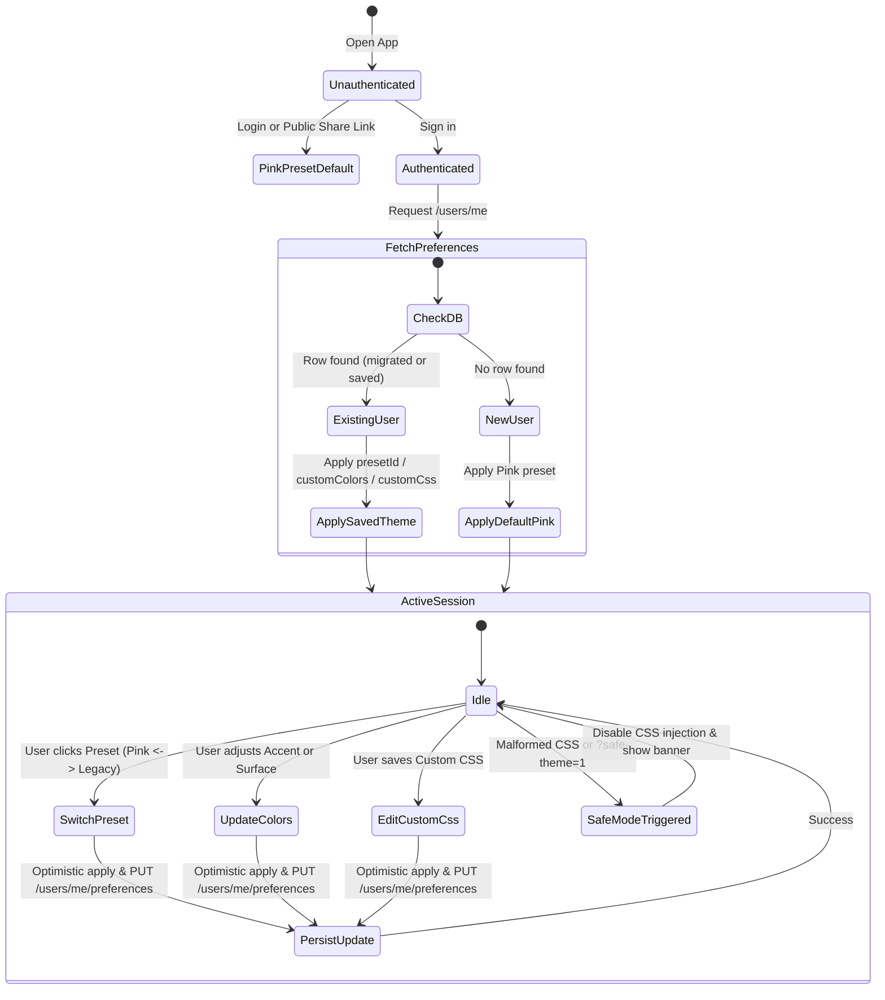

# Data Model: User Theme Customization

**Feature**: `016-user-theme-customization`  
**Date**: 2026-09-19  
**Status**: Ready for Implementation  

---

## 1. Entities & Relationships



---

## 2. Entity Specifications

### 2.1 `UserPreference`

Represents an individual user's stored visual styling choices.

| Field | Type | Required | Default | Validation & Rules |
|---|---|---|---|---|
| `user_id` | `int64` | Yes | N/A | Primary Key; foreign key referencing `users(id)` with `ON DELETE CASCADE`. |
| `theme_type` | `string` | Yes | `'preset'` | Enum: `'preset'`, `'custom_colors'`, `'custom_css'`. |
| `preset_id` | `string` | Yes | `'pink'` | Enum: `'pink'`, `'legacy'`. Active preset when `theme_type == 'preset'`, or fallback preset. |
| `appearance_mode`| `string` | Yes | `'system'` | Enum: `'light'`, `'dark'`, `'system'`. Controls light/dark/system mode. |
| `custom_accent` | `string` | No | `null` | Hex color code (e.g. `'#3B82F6'`). Validated by regex `^#([0-9a-fA-F]{6})$`. |
| `custom_surface`| `string` | No | `null` | Hex color code (e.g. `'#18181B'`). Validated by regex `^#([0-9a-fA-F]{6})$`. |
| `custom_css` | `string` | No | `null` | Raw CSS text. Max length 65,536 characters (64 KB). Must not contain `</style>` or `<script>`. |
| `updated_at` | `string` | Yes | `datetime('now')` | RFC-3339 timestamp of last update. |

---

### 2.2 `ThemePreset`

A static, immutable preset definition bundled with the frontend application.

| Field | Type | Description |
|---|---|---|
| `id` | `ThemePresetId` | Unique preset identifier (`"pink"` or `"legacy"`). |
| `name` | `string` | User-facing display title (`"Modern Pink"` or `"Legacy Orange"`). |
| `description` | `string` | Brief explanation of the aesthetic. |
| `primaryAccent` | `string` | Characteristic accent hex color (`#FF4FA3` for Pink, `#F97316` for Legacy). |
| `surfaceDark` | `string` | Characteristic dark surface hex (`#1C1A20` for Pink, `#171717` for Legacy). |
| `surfaceLight` | `string` | Characteristic light surface hex (`#FFF7FB` for Pink, `#F8FAFC` for Legacy). |

---

### 2.3 `ClientThemeState`

The client-side in-memory and local cache representation.

```typescript
export type ThemeType = "preset" | "custom_colors" | "custom_css";
export type ThemePresetId = "pink" | "legacy";
export type AppearanceMode = "light" | "dark" | "system";

export interface CustomColorConfig {
  accent: string;       // #RRGGBB
  surface: string;      // #RRGGBB
}

export interface UserThemePreferences {
  themeType: ThemeType;
  presetId: ThemePresetId;
  appearanceMode: AppearanceMode;
  customColors?: CustomColorConfig;
  customCss?: string;
  updatedAt?: string;
}
```

---

## 3. Database Schema & Migration

### Migration File: `api/internal/db/migrations/010_user_theme_preferences.sql`

```sql
-- Create user_preferences table
CREATE TABLE user_preferences (
    user_id          INTEGER PRIMARY KEY REFERENCES users(id) ON DELETE CASCADE,
    theme_type       TEXT NOT NULL DEFAULT 'preset',
    preset_id        TEXT NOT NULL DEFAULT 'pink',
    appearance_mode  TEXT NOT NULL DEFAULT 'system',
    custom_accent    TEXT,
    custom_surface   TEXT,
    custom_css       TEXT,
    updated_at       TEXT NOT NULL DEFAULT (datetime('now'))
);

CREATE INDEX idx_user_preferences_user ON user_preferences(user_id);

-- Migration rule: Pre-existing accounts created before this migration
-- are explicitly initialized with the legacy orange & dark theme.
INSERT INTO user_preferences (user_id, theme_type, preset_id, appearance_mode)
SELECT id, 'preset', 'legacy', 'system'
FROM users;
```

---

## 4. State Transitions



---

## 5. Validation Rules

1. **Authentication Gate**: Only authenticated users can read or write `user_preferences`.
2. **Preset Identifier Validation**: `presetId` must strictly equal `"pink"` or `"legacy"`.
3. **Theme Type Validation**: `themeType` must strictly equal `"preset"`, `"custom_colors"`, or `"custom_css"`.
4. **Appearance Mode Validation**: `appearanceMode` must strictly equal `"light"`, `"dark"`, or `"system"`.
5. **Color Format Validation**: Any provided `custom_accent` or `custom_surface` must be a valid 6-character hex color string starting with `#`.
6. **Custom CSS Limits & Sanitization**:
   - Maximum length: 65,536 characters.
   - Text containing `<style`, `</style`, `<script`, or `</script` is rejected with `400 Bad Request`.
